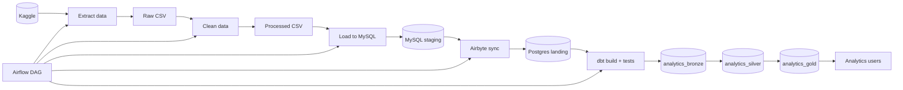
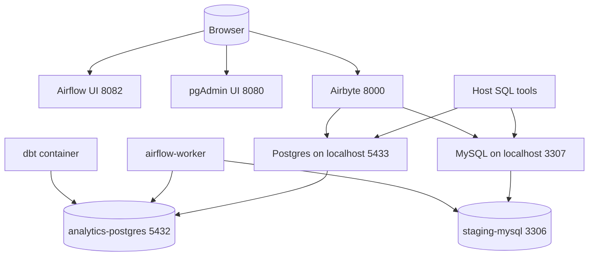

# Flight Price Analysis — Architecture

This document provides **separate, focused architecture diagrams** for the project:
1) logical/dataflow architecture
2) runtime/environment architecture (containers, networks, ports, and how services talk to each other)

> Diagrams are written in **Mermaid**. In VS Code, install a Mermaid preview extension (or view on GitHub, which renders Mermaid in Markdown).

---

## 1) Logical / Dataflow Architecture



**Notes**
- The dbt “layer schemas” are implemented as Postgres schemas like `analytics_bronze`, `analytics_silver`, `analytics_gold`.
- KPI relations live in `analytics_gold` (e.g., `analytics_gold.kpi_average_fare_by_airline`).

---

## 2) Runtime / Environment Architecture (Local Host + Docker + Airbyte)

This diagram answers: **what runs where**, **which ports are exposed**, and **which hostnames to use**.



### 2.1 Port map (what to open on localhost)

| Purpose | URL / Host Port | Notes |
|---|---:|---|
| Airflow UI | `http://localhost:8082` | Airflow webserver exposed as `8082 → 8080` |
| Flower | `http://localhost:5555` | Celery monitoring |
| Analytics Postgres | `localhost:5433` | Maps to container `analytics-postgres:5432` |
| Staging MySQL | `localhost:3307` | Maps to container `staging-mysql:3306` |
| pgAdmin (if used) | `http://localhost:8080` | Only if you have a pgAdmin container/app running |
| Airbyte (abctl) | `http://localhost:8000` | abctl proxy to the Airbyte control plane |

### 2.2 Connection rules (important)

- **From your Windows host tools (pgAdmin, psql, DBeaver):**
  - Postgres host: `localhost`, port: `5433`
  - MySQL host: `localhost`, port: `3307`

- **From containers (Airflow/dbt) to Postgres/MySQL inside the compose network:**
  - Postgres host: `analytics-postgres`, port: `5432`
  - MySQL host: `staging-mysql`, port: `3306`

- **From containers (Airflow/dbt) to Airbyte managed outside compose:**
  - Use `host.docker.internal:<port>` (typically `host.docker.internal:8000`).

---

## 3) Key environment variables / configuration surfaces

These are the knobs that control connectivity and object placement.

### 3.1 dbt (profiles)
- `POSTGRES_HOST` (default in docker: `analytics-postgres`)
- `POSTGRES_PORT` (default in docker: `5432`)
- `POSTGRES_USER` (default: `analytics_user`)
- `POSTGRES_PASSWORD` (set in compose)
- `POSTGRES_DATABASE` (default: `flight_price_analysis_analytics_db`)

### 3.2 Airflow Variables (project behavior)
- `FLIGHT_PIPELINE_RUN_EXTRACTION` (0/1)
- `FLIGHT_PIPELINE_AIRBYTE_WAIT` (0/1)
- `FLIGHT_PIPELINE_DBT_SELECT` (default: `+gold`)

---

## 4) Where the KPI tables actually are

In Postgres, KPIs are created as:
- `analytics_gold.kpi_average_fare_by_airline` (view)
- `analytics_gold.kpi_booking_count_by_airline` (view)
- `analytics_gold.kpi_popular_routes` (view)
- `analytics_gold.kpi_seasonal_analysis` (table)

Quick check:
```sql
SELECT table_schema, table_name, table_type
FROM information_schema.tables
WHERE table_name LIKE 'kpi_%'
ORDER BY table_schema, table_name;
```
